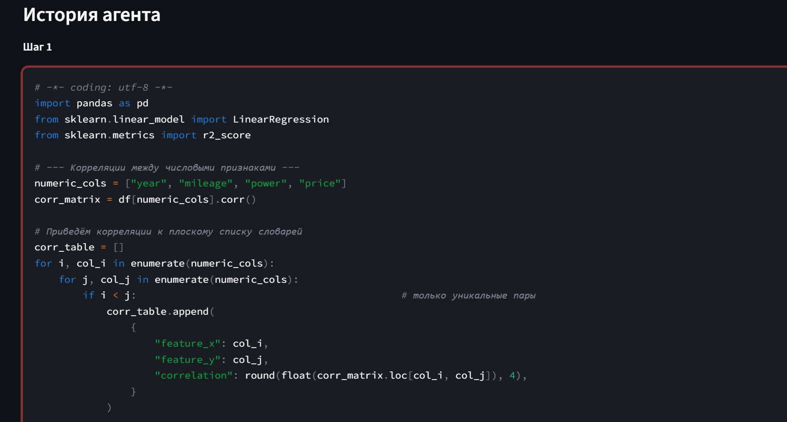
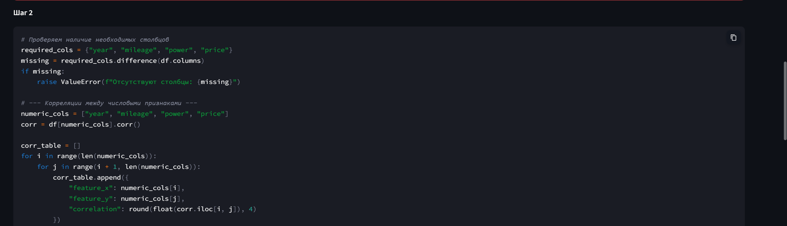
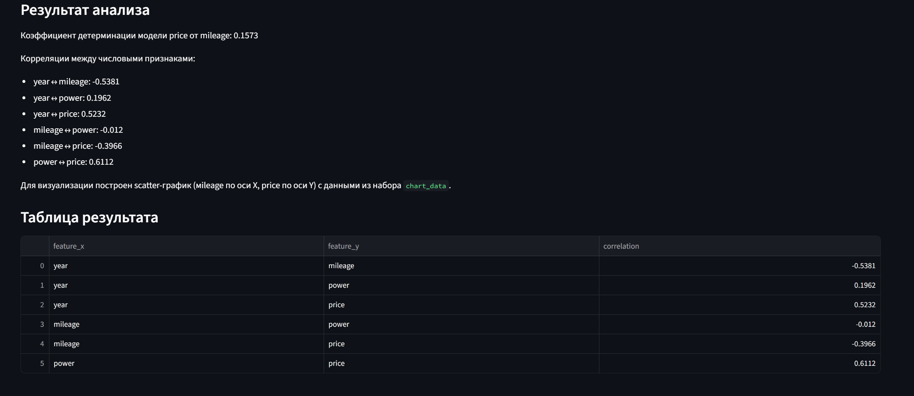
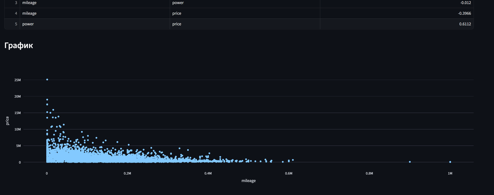

В работе использовалась модель openai/gpt-oss-120b:free

Пользователь пишет запрос, прикрепляет датасет и ллм его анализирует.
ЛЛМ сама решает, сколько ей нужно шагом для анализа. может хватить одного запроса, а может на освоне предыдущих шагов выпополнить несколько.
Максимальное число этих шагов задается переменной max_steps=3, чтобы ллм не решала, что ей необходимо бесконечно 
углублять изучение вопроса.

Сначала ллм генерит код, в exec он выполняется ( предварительно защита от зловредного кода и инструкций скрытых).  
Если в сгенерированном коде есть  "os", "sys", "subprocess", "socket",  
    "requests", "pathlib", "shutil",
    "pickle", "importlib", то он не сработает и вылетит ошибка.

---

 Также есть возможность посмотреть на код
и убедиться в его правильности или неправильности
На основе вычисленных значений и метрик ллм может построить таблицу, один из трех типов графиков ("line" | "bar" | "scatter",) и текст. 
---

Ллм может и не строить таблицу, текст или график, если посчитает это нужным. Тип графика она тоже на свое усмотрение определяет.
Пользоваьтель не указывал для каких параметров считать коэфицент детерминации, но ллм сама смогла определить для кого именно ее считать и посчитала ее.

   
 

